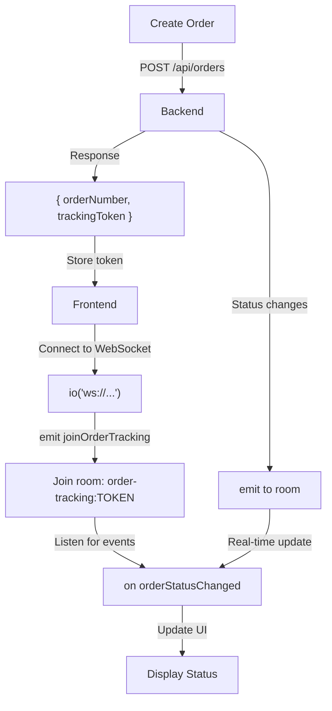

# 📦 Order Tracking via WebSocket

## Overview

El sistema permite a clientes WEB rastrear sus órdenes en tiempo real usando WebSocket. El cliente se conecta con un `trackingToken` y recibe actualizaciones instantáneas cuando el estado de la orden cambia.

---

## 🎯 Architecture

```
WEB Client
    ↓
[trackingToken]
    ↓
Socket.IO Connection
    ↓
Join room: order-tracking:{trackingToken}
    ↓
Listen to events:
  - orderStatusChanged
  - disconnect/error
```

---

## 🔧 Backend Implementation

### 1. Order Creation Response

**Endpoint:** `POST /api/orders`

```json
// WEB order response
{
  "success": true,
  "data": {
    "orderNumber": 123,
    "trackingToken": "550e8400-e29b-41d4-a716-446655440000"
  }
}

// POS order response (unchanged)
{
  "success": true,
  "data": { /* full order object */ },
  "message": "Order created successfully..."
}
```

### 2. WebSocket Events Emitted

**Room:** `order-tracking:{trackingToken}`

**Event:** `orderStatusChanged`

```typescript
{
  orderNumber: number;      // e.g., 123
  status: string;           // PENDING | PREPARING | READY | COMPLETED | CANCELLED
  updatedAt: string;        // ISO timestamp
}
```

**Example Flow:**
```
1. Order created: status = PENDING
2. Kitchen starts: status = PREPARING → emit orderStatusChanged
3. Ready: status = READY → emit orderStatusChanged
4. Completed: status = COMPLETED → emit orderStatusChanged
```

### 3. HTTP Fallback

**Endpoint:** `GET /api/orders/track/{trackingToken}`

Use when WebSocket is unavailable (fallback mechanism):

```json
{
  "success": true,
  "data": {
    "orderNumber": 123,
    "type": "DELIVERY",
    "status": "PREPARING",
    "createdAt": "2026-01-22T12:00:00.000Z",
    "updatedAt": "2026-01-22T12:05:30.000Z"
  }
}
```

---

## 🌐 Frontend Integration

### Setup

**1. Install Socket.IO client:**
```bash
npm install socket.io-client
```

**2. Connect and join tracking room:**
```typescript
import io from 'socket.io-client';

// Get trackingToken from order creation response
const trackingToken = '550e8400-e29b-41d4-a716-446655440000';

// Connect to WebSocket server (no auth required)
const socket = io('http://localhost:5000', {
  reconnection: true,
  reconnectionDelay: 1000,
  reconnectionDelayMax: 5000,
  reconnectionAttempts: 5
});

// Join order tracking room
socket.on('connect', () => {
  console.log('Connected to server');
  socket.emit('joinOrderTracking', trackingToken);
});

// Listen for status changes
socket.on('orderStatusChanged', (data) => {
  console.log('Order updated:', data);
  // data = {
  //   orderNumber: 123,
  //   status: 'PREPARING',
  //   updatedAt: '2026-01-22T12:05:30.000Z'
  // }
  updateUI(data.status);
});

// Handle errors
socket.on('error', (error) => {
  console.error('WebSocket error:', error);
  // Fallback to HTTP polling
  pollOrderStatus(trackingToken);
});

// Handle disconnection
socket.on('disconnect', () => {
  console.log('Disconnected from server');
  // Implement fallback strategy
});
```

### React Hook Example

```typescript
import { useEffect, useState } from 'react';
import io, { Socket } from 'socket.io-client';

type OrderStatus = 'PENDING' | 'PREPARING' | 'READY' | 'COMPLETED' | 'CANCELLED';

interface OrderTracking {
  orderNumber: number;
  status: OrderStatus;
  updatedAt: string;
}

export function useOrderTracking(trackingToken: string) {
  const [order, setOrder] = useState<OrderTracking | null>(null);
  const [connected, setConnected] = useState(false);
  const [error, setError] = useState<string | null>(null);

  useEffect(() => {
    const socket = io(process.env.REACT_APP_API_URL || 'http://localhost:5000', {
      reconnection: true,
      reconnectionDelay: 1000,
      reconnectionAttempts: 5
    });

    socket.on('connect', () => {
      console.log('WebSocket connected');
      setConnected(true);
      socket.emit('joinOrderTracking', trackingToken);
    });

    socket.on('orderStatusChanged', (data: OrderTracking) => {
      console.log('Order updated:', data);
      setOrder(data);
      setError(null);
    });

    socket.on('error', (err: any) => {
      console.error('Socket error:', err);
      setError(err.message || 'Connection error');
      // Fallback to polling
      pollOrderStatus(trackingToken);
    });

    socket.on('disconnect', () => {
      console.log('WebSocket disconnected');
      setConnected(false);
    });

    return () => {
      socket.off('connect');
      socket.off('orderStatusChanged');
      socket.off('error');
      socket.off('disconnect');
      socket.disconnect();
    };
  }, [trackingToken]);

  return { order, connected, error };
}

// Usage in component
function OrderTracker({ trackingToken }: { trackingToken: string }) {
  const { order, connected, error } = useOrderTracking(trackingToken);

  if (error && !connected) {
    return <div>Error: {error}</div>;
  }

  if (!order) {
    return <div>Waiting for order updates...</div>;
  }

  return (
    <div>
      <h2>Order #{order.orderNumber}</h2>
      <p>Status: <strong>{order.status}</strong></p>
      <p>Last update: {new Date(order.updatedAt).toLocaleTimeString()}</p>
      <p>Connected: {connected ? '✅' : '⏳'}</p>
    </div>
  );
}
```

### Vue 3 Composition API Example

```typescript
import { ref, onMounted, onUnmounted } from 'vue';
import io from 'socket.io-client';

export function useOrderTracking(trackingToken: string) {
  const order = ref<any>(null);
  const connected = ref(false);
  const error = ref<string | null>(null);
  let socket: any = null;

  onMounted(() => {
    socket = io(import.meta.env.VITE_API_URL || 'http://localhost:5000', {
      reconnection: true,
      reconnectionDelay: 1000,
      reconnectionAttempts: 5
    });

    socket.on('connect', () => {
      console.log('Connected');
      connected.value = true;
      socket.emit('joinOrderTracking', trackingToken);
    });

    socket.on('orderStatusChanged', (data: any) => {
      order.value = data;
      error.value = null;
    });

    socket.on('error', (err: any) => {
      error.value = err.message || 'Connection error';
      connected.value = false;
    });

    socket.on('disconnect', () => {
      connected.value = false;
    });
  });

  onUnmounted(() => {
    socket?.disconnect();
  });

  return { order, connected, error };
}
```

### HTTP Polling Fallback

```typescript
async function pollOrderStatus(trackingToken: string, intervalMs: number = 15000) {
  setInterval(async () => {
    try {
      const response = await fetch(`/api/orders/track/${trackingToken}`);
      const data = await response.json();

      if (data.success) {
        updateUI(data.data.status);
      }
    } catch (error) {
      console.error('Polling error:', error);
    }
  }, intervalMs);
}
```

---

## 📊 Status Enum

```typescript
type OrderStatus =
  | 'PENDING'      // Initial state, waiting to start preparation
  | 'PREPARING'    // Being prepared in kitchen
  | 'READY'        // Ready for pickup/delivery
  | 'COMPLETED'    // Delivered or picked up
  | 'CANCELLED';   // Order was cancelled
```

---

## 🔐 Security

- ✅ **No authentication required** - Token is the authorization mechanism
- ✅ **UUID v4 tracking tokens** - 122 bits of entropy, impossible to guess
- ✅ **Unique constraint** - No duplicate tokens in database
- ✅ **Minimal data exposure** - Only non-sensitive order info (number, status, timestamps)
- ⚠️ **Rate limiting recommended** - Implement on production gateway (e.g., 30 req/min per IP)

---

## 📈 Performance

| Metric | WebSocket | HTTP Polling (15s) |
|--------|-----------|-------------------|
| Latency | <100ms | 0-15s |
| Updates/day | ~10 | ~5,760 |
| Bandwidth/order | ~200 bytes | ~4KB |
| Server load | Low | High |

---

## 🛠️ Troubleshooting

### WebSocket not connecting
- Check CORS settings on backend
- Verify WebSocket module is enabled: `npm run manage-modules status`
- Ensure Socket.IO version compatibility

### Missing `orderStatusChanged` events
- Verify client joined correct room: `order-tracking:{trackingToken}`
- Check backend logs for emission errors
- Confirm WEBSOCKET module is enabled

### Fallback to polling
- Implement exponential backoff
- Use conditional logic: WebSocket first, HTTP fallback
- Cache last known status to reduce requests

---

## 📝 Example Integration Flow



---

## 🔗 Related Endpoints

| Method | Path | Auth | Purpose |
|--------|------|------|---------|
| POST | `/api/orders` | PIN | Create order (returns trackingToken for WEB) |
| GET | `/api/orders/track/{token}` | None | HTTP fallback for tracking |
| WS | (join room) | None | WebSocket order tracking |

---

## 📚 Related Files

- Backend Service: `src/services/public-order-tracking.service.ts`
- WebSocket Service: `src/services/websocket.service.ts`
- Controller: `src/controllers/public-order-tracking.controller.ts`
- Routes: `src/routes/order.routes.ts`
- Migration: `prisma/migrations/.../migration.sql`
